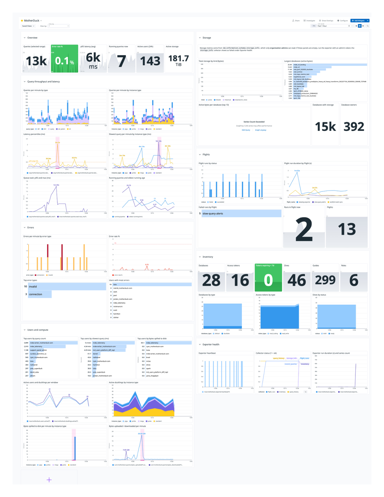

# Monitor MotherDuck in Datadog

A single-file Flight that runs every five minutes, reads MotherDuck's own
metadata views (`md_information_schema.query_history`, `recent_queries`,
`storage_info`, `md_access_tokens()`, `MD_LIST_FLIGHTS()`, ...), turns them
into Datadog custom metrics, and posts them to the Datadog metrics API. Next to
it sit an importable Datadog dashboard and nine ready-made monitors.

It demonstrates the MotherDuck pattern of **using a Flight as a metrics
exporter**: no agent, no host, no Datadog integration to install. The Flight
runtime provides the compute, the MotherDuck token and the schedule; the only
external credential is a Datadog API key stored as a Flights secret.



## How it works

```
MotherDuck metadata views ──► flight.py (every 5 min) ──► POST api.datadoghq.com/api/v2/series
                                   │
                                   └── datadog_exporter.main.state  (last exported window)
```

Each run of [`flight.py`](flight.py):

1. **Picks a window.** The window ends three minutes ago (`DELAY_SECONDS`, because
   `query_history` lags live traffic by one to two minutes) and starts where the previous
   run stopped. That watermark lives in a one-row table (`STATE_TABLE`, created
   on first run), so late or skipped runs never double-count or drop a minute.
   If the watermark is more than 55 minutes old the run catches up from there,
   because Datadog rejects points older than one hour.
2. **Aggregates completed queries per minute** from `query_history`, bucketed
   by `end_time`: counts by query type, instance type and status; errors by
   `error_type`; p50/p95/p99 latency and queue wait; spill, upload and download
   bytes; distinct users and ducklings; and per-user counts for the busiest
   `TOP_USERS` users. The five slowest queries of the window are printed to the
   run log for triage.
3. **Snapshots point-in-time gauges**: running queries and the age of the
   oldest one (`recent_queries`), org storage totals and the largest databases
   (`storage_info`, admin only), databases, access tokens and tokens expiring
   within 7 days, Flights (and the runs that finished in the window for the
   Flights in `FLIGHT_RUN_SCOPE`), Dives, Guides and roles.
4. **Posts to Datadog** in gzip-compressed batches of 500 series with retries
   on 429/5xx, then advances the watermark. A failed post leaves the watermark
   untouched, so the next run retries the same window.

Every collector is isolated. If one fails (for example `storage_info` when the
token is not an org admin) the run logs a warning, reports it as
`motherduck.exporter.collector_ok{collector:storage_info} = 0`, and still ships
everything else. The `exporter.heartbeat` gauge is the signal that the exporter
itself is alive.

Counts are sent as Datadog `count` metrics with a 60 s interval (query them
with `.as_count()`); everything else is a `gauge`. Every series carries
`md_org:<organization>` (when `md_user_info()` is available) plus any
`DD_TAGS` you configure.

### Metrics

All names are prefixed with `METRIC_PREFIX` (default `motherduck`).

| Metric | Type | Tags | Meaning |
| --- | --- | --- | --- |
| `queries.count` | count | `query_type`, `instance_type`, `status` | Queries finished per minute (`status` is `ok` or `error`) |
| `queries.errors` | count | `error_type` | Failed queries per minute by DuckDB error class |
| `queries.latency.p50_ms` / `p95_ms` / `p99_ms` | gauge | | Latency percentiles of successful queries per minute |
| `queries.latency.max_ms` / `avg_ms` | gauge | `query_type`, `instance_type` | Slowest and mean successful query per minute |
| `queries.wait.p95_ms` / `wait.max_ms` | gauge | (`query_type`, `instance_type` for max) | Time spent queued before execution |
| `queries.spilled.count` / `spilled.bytes` | count | `query_type`, `instance_type` | Queries that spilled to disk and how much |
| `queries.bytes_uploaded` / `bytes_downloaded` | count | `query_type`, `instance_type` | Bytes moved between client and MotherDuck |
| `queries.by_user.count` / `errors` / `latency.max_ms` / `spilled.bytes` | count, gauge | `user_name` | Per-user activity for the busiest `TOP_USERS` users of the window |
| `queries.running` / `running.users` / `running.oldest_age_sec` | gauge | | Queries in flight right now, distinct users, age of the oldest |
| `queries.running_by_type` | gauge | `query_type`, `instance_type` | Running queries broken down |
| `users.active` / `users.active_24h` | gauge | | Distinct users in the window and in the last 24 h |
| `ducklings.active` / `ducklings.active_by_type` | gauge | (`instance_type`) | Distinct ducklings that served queries in the window |
| `storage.bytes` | gauge | `database_name`, `owner`, `kind`, `transient` | Storage of the `STORAGE_TOP_DATABASES` largest databases; `kind` is `active`, `historical`, `retained_for_clone` or `failsafe` |
| `storage.total_bytes` | gauge | `kind` (incl. `all`) | Org-wide storage by kind |
| `storage.databases` / `storage.owners` | gauge | | Databases with storage and distinct owners |
| `databases.count` | gauge | `database_type` | Databases visible to the token (`default`, `ducklake`, ...) |
| `access_tokens.count` / `access_tokens.expiring_7d` | gauge | `token_type` | Access tokens of the Flight's user, and how many expire within 7 days |
| `flights.count` | gauge | `status`, `schedule_status` | Flights visible to the token |
| `flights.runs` | count | `flight_name`, `status` | Flight runs that ended in the window |
| `flights.run_duration_sec` | gauge | `flight_name` | Duration of each finished run |
| `flights.runs_in_flight` | gauge | `flight_name` | Pending or running runs right now |
| `flights.tracked` | gauge | | Flights the run-metrics collector covered this run (compare with `flights.count` to spot a spent budget) |
| `dives.count` / `guides.count` / `roles.count` | gauge | `status` / `access` / `role_type` | Inventory |
| `exporter.heartbeat` / `duration_sec` / `series_count` | gauge | | Exporter liveness and cost |
| `exporter.collector_ok` / `collector_duration_sec` | gauge | `collector` | 1 when that collector succeeded this run, and how long it took |

### Dashboard and monitors

- [`datadog/dashboard.json`](datadog/dashboard.json) is a Datadog dashboard
  (ordered layout, `md_org` template variable) with eight groups: Overview,
  Query throughput and latency, Errors, Users and compute, Storage, Flights,
  Inventory, Exporter health.
- [`datadog/monitors.json`](datadog/monitors.json) holds nine metric monitors:
  error rate above 5 %, p95 latency above 30 s, a query running longer than
  30 min, heavy spill to disk, a failed Flight run, an access token expiring
  within 7 days, active storage growing more than 25 % in a day, the exporter
  not reporting, and a collector failing.
- [`datadog/setup_datadog.py`](datadog/setup_datadog.py) creates both through
  the Datadog API and updates them in place on re-runs (matched by title and
  name). You can also paste `dashboard.json` into **Dashboards > New Dashboard
  > Import** in the Datadog UI.

## Questions to answer

- Which Datadog site is the account on (`datadoghq.com`, `datadoghq.eu`,
  `us3.datadoghq.com`, `us5.datadoghq.com`, `ap1.datadoghq.com`)? It changes
  both the API host and the dashboard URL.
- Does the user who owns the Flight hold the RBAC preset **Admin** role? Only
  admins can read `storage_info`; without it the Storage group stays empty and
  the `storage_info` collector reports as failed. `query_history` is
  org-wide for every user.
- How many databases and users does the organization have? Each database in
  `STORAGE_TOP_DATABASES` adds four `storage.bytes` series and each user in
  `TOP_USERS` adds four series, which is what Datadog bills custom metrics on.
  Keep both small; totals are always emitted regardless.
- Which tags should every series carry (`env`, `team`, ...), via `DD_TAGS`?
- Who should the monitors notify? The `@slack-data-platform` handle in
  `monitors.json` is a placeholder.
- Which Flights should have their runs tracked: only the exporter owner's
  (`FLIGHT_RUN_SCOPE=own`), every scheduled Flight in the org (`scheduled`, needs
  an admin), or none? Each tracked Flight costs one call per run.

## Caveats

- **Datadog accepts points at most one hour old.** The exporter cannot backfill
  history, so a schedule gap longer than an hour loses data. Run it every 5
  minutes and alert on `exporter.heartbeat` (the "Exporter is not reporting"
  monitor does this).
- **`storage_info` needs the RBAC preset `Admin` role.** Other users get
  `User not authorized`; the collector is skipped, not fatal. A newly granted
  role took a few minutes to apply to Flight runs in testing. `md_access_tokens()` and
  `MD_LIST_FLIGHTS()` only see the Flight owner's own tokens and Flights unless
  the owner is an admin.
- **Custom-metric cardinality is the cost driver.** Tags were chosen so the
  core `queries.*` metrics stay at (query types × instance types × 2) series.
  Per-user and per-database metrics are capped (`TOP_USERS`,
  `STORAGE_TOP_DATABASES`): an org with 15,000 databases would otherwise emit
  60,000 storage series per run. Leave `user_name` and `database_name` off
  anything new you add unless you need it.
- **Per-minute percentiles are noisy on quiet orgs.** With a handful of queries
  per minute, p95 and p99 are effectively the slowest query. Smooth them on the
  dashboard (`.rollup(avg, 300)`) or alert on `avg(last_15m)`, as the shipped
  monitor does.
- **Timezones.** The Flight runtime has no timezone configured, so the exporter
  pins `SET TimeZone = 'UTC'` before reading any `TIMESTAMPTZ` column; without
  it the duckdb client raises `'Etc/Unknown'`. Keep that line if you add
  queries.
- **`recent_queries` is a live view and dislikes some predicates.** A
  `WHERE end_time IS NULL` filter, `ORDER BY start_time` or an unbounded row
  scan on it can fail with an internal MotherDuck error. The exporter only runs
  plain aggregates against it (`count(*) - count(end_time)`) and retries each
  read (while the run is under 90 s old), because the view also fails
  intermittently and a failing read can take most of a minute to error; keep
  to that shape if you extend it.
- **`limit` and `order` are reserved words.** Named arguments to
  `MD_LIST_FLIGHT_RUNS` and `MD_GET_FLIGHT_LOGS` must be double-quoted:
  `"limit" := 100`.
- **The state table needs a writable database.** `STATE_TABLE` defaults to
  `datadog_exporter.main.state`, which the Flight creates. Set it to `""` for a
  stateless exporter (each run then exports the previous `WINDOW_MINUTES`,
  which can double-count a minute if a run starts late).
- **Runs must not overlap.** The watermark is read at the start of a run and
  written at the end, so two concurrent runs would export the same window
  twice. A run that finds a previous run of the same Flight still `RUNNING`
  skips itself and logs why; the next run covers the window. Cap runs below the
  schedule interval too (`--max-runtime 240` with a 5-minute cron).
- **An admin token sees the whole organization.** `MD_LIST_FLIGHTS()`,
  `flights.count` and `FLIGHT_RUN_SCOPE=all` then cover every Flight in the org
  (hundreds in a busy org, at ~0.5 s per Flight for run metrics), which is why
  the default scope is `own` and the collector has a time budget.
- **One org per Flight.** The exporter reports on the organization of the token
  it runs with. Deploy one Flight per organization if you have several and let
  the `md_org` tag separate them.

## What you'll adjust

Everything is an environment variable. Locally you `export` it; on a Flight it
is a `config` key, except the API key, which is a Flights secret.

| Knob | Default | Purpose |
| --- | --- | --- |
| `DD_API_KEY` | (secret) | Datadog API key. Flights secret param; the code also accepts the namespaced `<secret>_DD_API_KEY` |
| `DD_SITE` | `datadoghq.com` | Datadog site for the intake endpoint `https://api.<site>/api/v2/series` |
| `DD_TAGS` | (none) | Comma-separated tags added to every series, e.g. `env:prod,team:data` |
| `METRIC_PREFIX` | `motherduck` | Metric namespace. If you change it, pass `--prefix` to `setup_datadog.py` |
| `WINDOW_MINUTES` | `5` | Window size for the first run and for stateless mode. Match the cron |
| `DELAY_SECONDS` | `180` | How far behind "now" the window ends, to let `query_history` settle |
| `STATE_TABLE` | `datadog_exporter.main.state` | Watermark table (`database.schema.table`); `""` disables state |
| `TOP_USERS` | `20` | Busiest users per window that get `queries.by_user.*` series; `0` disables |
| `STORAGE_TOP_DATABASES` | `25` | Largest databases (by active bytes) that get per-database `storage.bytes` series; `0` disables. Totals are always sent |
| `FLIGHT_RUN_SCOPE` | `own` | Which Flights get run metrics: `own`, `scheduled` (every scheduled Flight the token can see), `all`, or `none` |
| `FLIGHT_RUNS_BUDGET_SEC` | `60` | Time budget for the Flight-runs collector (about 0.5 s per Flight); it stops and warns when spent |
| `DRY_RUN` | `false` | Print the series and skip the POST; smoke-test without a key |
| `MOTHERDUCK_TOKEN` | (Flight-injected) | Attached automatically to a Flight; export it for local runs |
| Schedule | `*/5 * * * *` | Set with `--schedule` on `deploy_flight.py` or `MD_UPDATE_FLIGHT` |
| Monitor thresholds and `@` handles | see `monitors.json` | Edit the JSON, re-run `setup_datadog.py` |

## Run it

Prerequisites: a MotherDuck account and access token, a Datadog API key, and
for the dashboard/monitors a Datadog application key with `dashboards_write`
and `monitors_write`. [`uv`](https://docs.astral.sh/uv/) runs the scripts with
pinned dependencies.

### 1. Smoke-test locally

```bash
export MOTHERDUCK_TOKEN=<your-motherduck-token>
DRY_RUN=true uv run --with-requirements requirements.txt flight.py
```

This prints the window, each collector's outcome, the slowest queries and a
sample of the series without posting anything. Then post for real:

```bash
export DD_API_KEY=<datadog-api-key>
export DD_SITE=datadoghq.com
uv run --with-requirements requirements.txt flight.py
```

Metrics appear under `motherduck.*` in **Metrics > Explorer** within a minute.

### 2. Deploy as a Flight

Store the API key as a MotherDuck **Flights secret** named `datadog` with one
param, `DD_API_KEY`. The quickest path is the UI, which prefills the names
without the value ever leaving your browser:
<https://app.motherduck.com/settings/secrets?action=create&type=flights&name=datadog&params=DD_API_KEY>.
Or from a write-enabled SQL connection:

```sql
CREATE SECRET datadog IN motherduck (
  TYPE flights,
  PARAMS MAP { 'DD_API_KEY': '<datadog-api-key>' }
);
```

Then register the Flight. [`deploy_flight.py`](deploy_flight.py) resolves it by
name through `MD_LIST_FLIGHTS()`, so the same command creates it the first time
and updates it after you edit `flight.py`:

```bash
export MOTHERDUCK_TOKEN=<token that can manage Flights>
uv run --with-requirements requirements.txt deploy_flight.py \
  --secret datadog \
  --config DD_SITE=datadoghq.com --config DD_TAGS=env:prod \
  --schedule "*/5 * * * *" --max-runtime 240 \
  --run
```

`--run` triggers one run, polls it to completion and prints its log, so the
first deploy doubles as the end-to-end test. Pass `--token-name <label>` to run
with a specific access token (an org admin's token unlocks storage metrics;
list labels with `SELECT * FROM md_access_tokens()`), and `--max-runtime` to cap a run
(keep it below the schedule interval, see Caveats).

Without the script, call the SQL surface directly: `MD_CREATE_FLIGHT` with
`source_code` = `flight.py`, `requirements_txt` = `requirements.txt`,
`flight_secret_names := ['datadog']`, `config := MAP {'DD_SITE': 'datadoghq.com'}`
and `schedule_cron := '*/5 * * * *'`; trigger with `MD_RUN_FLIGHT` and read the
log with `MD_GET_FLIGHT_LOGS`.

### 3. Create the dashboard and monitors

```bash
export DD_API_KEY=<datadog-api-key>
export DD_APP_KEY=<datadog-application-key>
export DD_SITE=datadoghq.com
uv run --with httpx datadog/setup_datadog.py
```

The script prints the dashboard URL and the monitor ids. Edit the JSON (for
instance the `@slack-...` handles and thresholds in `monitors.json`) and re-run
it to update in place; add `--no-monitors` to touch only the dashboard, or
`--prefix <METRIC_PREFIX>` if you renamed the metrics.

### Verify

- `SELECT * FROM datadog_exporter.main.state` shows the last exported window
  advancing every five minutes.
- In Datadog, `motherduck.exporter.heartbeat` is 1 on every run and
  `motherduck.exporter.collector_ok` is 1 for every collector you expect
  (`storage_info` will be 0 for a non-admin token).
- The Flight's run log lists each metric with its point count and the five
  slowest queries of the window.

## Security

- **Secrets never touch code or config.** The Datadog API key is read from the
  environment (`DD_API_KEY` or the namespaced `datadog_DD_API_KEY` injected by
  the Flights secret). The MotherDuck token is injected by the runtime. Neither
  is logged; the one place a Datadog error body is printed is truncated and
  never echoes the key.
- **Identifier validation.** `STATE_TABLE` is split on `.` and each part is
  checked against `^[A-Za-z_][A-Za-z0-9_]*$` before it is interpolated into
  `CREATE`/`INSERT` statements. Every other SQL value (window bounds, user
  limits, Flight ids) is a bound parameter.
- **Tag sanitising.** User names, database names and error types become
  Datadog tag values; they are lower-cased and restricted to
  `[a-z0-9_\-:./]` so a strange name cannot break a query or inject a tag.
- **Read mostly.** The exporter reads metadata views and writes exactly one
  row to the state table. A read-write token is needed only for that table;
  the MotherDuck UI's Flights default token works.
- **What leaves MotherDuck.** Metric values and tags, including user names,
  database names and Flight names, are sent to Datadog. Query text never is;
  only the Flight log shows the slowest queries, and only to people who can
  read the Flight.
- **Datadog keys.** The Flight needs only an API key (write metrics). The
  application key for `setup_datadog.py` is for a one-off local run; scope it
  to `dashboards_write` and `monitors_write`.

## Learn more

- [`flight.py`](flight.py): the exporter. Collectors are small functions near
  the bottom; add a metric by writing a query and calling `series.add(...)`.
- [`deploy_flight.py`](deploy_flight.py): register, update and run the Flight
  through `MD_CREATE_FLIGHT` / `MD_UPDATE_FLIGHT` / `MD_RUN_FLIGHT`.
- [`datadog/`](datadog/): `dashboard.json`, `monitors.json`, `setup_datadog.py`.
- [`tests/`](tests/): unit tests for series batching, tag cleaning and window
  arithmetic (`uv run --with pytest --with-requirements requirements.txt -m pytest`).
- MotherDuck metadata views: [`query_history`](https://motherduck.com/docs/sql-reference/motherduck-sql-reference/md_information_schema/query_history/),
  [`recent_queries`](https://motherduck.com/docs/sql-reference/motherduck-sql-reference/md_information_schema/recent_queries/),
  [`storage_info`](https://motherduck.com/docs/sql-reference/motherduck-sql-reference/md_information_schema/storage_info/).
- Datadog: [Submit metrics API](https://docs.datadoghq.com/api/latest/metrics/#submit-metrics),
  [custom metrics billing](https://docs.datadoghq.com/account_management/billing/custom_metrics/),
  [Dashboards API](https://docs.datadoghq.com/api/latest/dashboards/),
  [Monitors API](https://docs.datadoghq.com/api/latest/monitors/).
- For Flight mechanics (secrets, schedules, versions, logs) use the MotherDuck
  MCP `get_flight_guide` tool; for anything about the metadata views, `ask_docs_question`.
