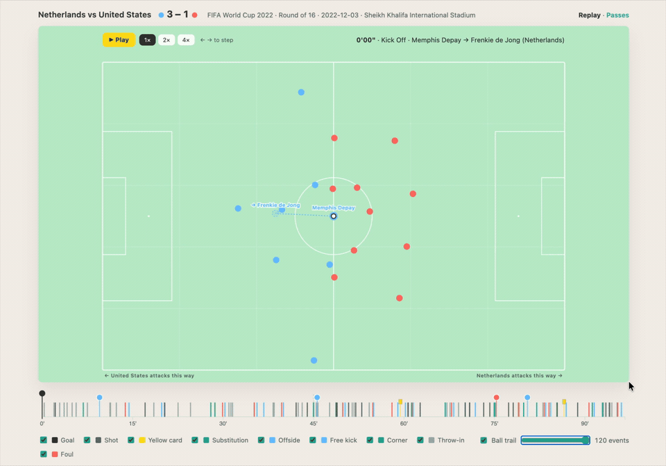

# StatsBomb 360 Football Matches — Flights pipeline + animated Dive

A football-analytics stack built entirely on MotherDuck. Three **Flights** turn
[StatsBomb open-data](https://github.com/statsbomb/open-data) — the event stream
plus 360 freeze-frame player tracking — into a clean `statsbomb` database, and a
**Dive** renders it: an animated match replay (players, ball, passes, a scrubbable
timeline) and a Passes & Shots explorer (per-team shot maps and per-player flight
rows). Everything reads and writes the one `statsbomb` database.



Two decoupled slices:

| Slice | What it is |
|---|---|
| [`flight/`](./flight/) | A three-stage Python/SQL pipeline run as MotherDuck **Flights**: `statsbomb-raw-load` (download open-data into `raw.*`), `statsbomb-core-transform` (de-normalize coordinates and resolve player tracking into `core.*`, all in-warehouse SQL), and `statsbomb-marts` (analysis-ready `marts.*` tables the Dive reads). |
| [`dive/`](./dive/) | A single-file MotherDuck **Dive** — an animated replay and a Passes & Shots explorer, built with D3 and deployed as code. Reads what `flight/` writes. |

The Flights keep the `statsbomb` database current; the Dive queries it live. Each
slice's README covers its own development and deploy details.

## Try it without building

The `statsbomb` database is also published as a **public, read-only MotherDuck
share**, so you can explore the prebuilt `raw` / `core` / `marts` schemas — or
point the Dive at them — without running the ingest Flights yourself. Attach it
directly:

```sql
ATTACH 'md:_share/statsbomb/80f66346-f45d-47c1-8b17-9fef083ba22b' AS statsbomb (READ_ONLY);
FROM statsbomb.marts.match_stats LIMIT 10;
```

To deploy your own copy of the Dive against the share instead of a database you
built, pass the share URL as the resource:

```bash
SB_RESOURCE_URL='md:_share/statsbomb/80f66346-f45d-47c1-8b17-9fef083ba22b' \
  ./dive/scripts/deploy-dive.sh
```

Anyone with the share URL in the same cloud region (`aws-us-east-1`) can attach it.

## How it works

- [`flight/README.md`](./flight/README.md) — the `raw -> core -> marts` pipeline, the StatsBomb data quirks it corrects (e.g. possession-normalized coordinates), registering and running the Flights, and the knobs.
- [`dive/README.md`](./dive/README.md) — the replay + Passes & Shots Dive, running it locally, deploying it, and why the bespoke visuals run D3 inside React.

## Questions to answer

- **Build it yourself, or just use the public share?** To explore the data or demo the Dive, attach the prebuilt share above — no pipeline run needed. Run the Flights when you want your own copy or fresher data.
- **How much data?** The full open-data set is large, so `statsbomb-raw-load` takes `COMPETITION_IDS` / `MATCH_LIMIT` to start with one competition (e.g. the 2022 World Cup) or a handful of matches.

## What you'll adjust

| Knob | Where | Purpose |
|---|---|---|
| Target database | `statsbomb` literal in each `flight/flights/*/main.py` and the Dive's `statsbomb` resource alias | The one database the whole stack reads/writes. |
| `COMPETITION_IDS`, `MATCH_LIMIT` | per-run config on `statsbomb-raw-load` | Limit ingest scope (one competition, or a smoke-test cap). |
| `MATCH_IDS` | per-run config on `statsbomb-core-transform` | Rebuild a single match instead of the whole corpus. |
| `DIVE_TITLE`, `SB_DATABASE` | env for `dive/scripts/deploy-dive.sh` | Dive title to create/update and the database its `statsbomb` alias binds to. |

## Learn more

- [StatsBomb open-data](https://github.com/statsbomb/open-data) — the source event + 360 data and its specification.
